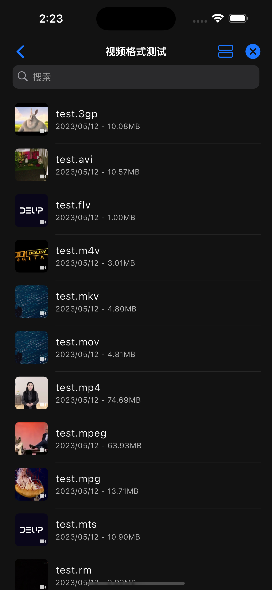
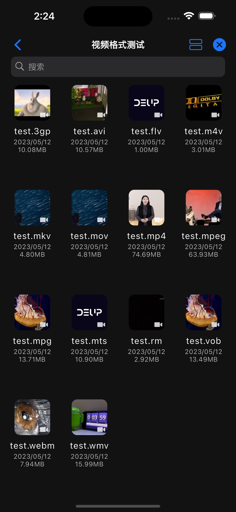
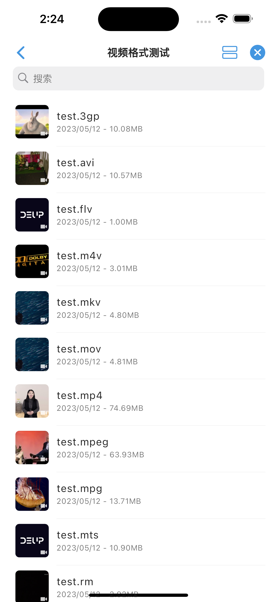

# Alist

{ width="200" } { width="200" } { width="200" }

[https://cdn.jsdelivr.net/gh/deup-io/deup/alist.js](https://cdn.jsdelivr.net/gh/deup-io/deup/alist.js){target=_blank}

```javascript
/**
 * Alist plugin for Deup
 *
 * @class Alist
 * @extends {Deup}
 * @author ZiHang Gao
 * @see https://alist.nn.ci
 */
class Alist extends Deup {
  /**
   * Define the basic configuration of the alist plugin
   *
   * color: '#FFFFFF' // The text color
   * background: ['#4995EC', '#4BA5E9'] // The background color
   *
   * @type {{headers: {"User-Agent": string, "Accept-Encoding": string, "Accept-Language": string}, color: string, background: string[], name: string, logo: string}}
   */
  config = {
    name: 'Alist',
    logo: 'https://jsd.nn.ci/gh/alist-org/logo@main/logo.svg',
    color: '#FFFFFF',
    background: ['#4995EC', '#4BA5E9'],
    headers: {
      'User-Agent':
        'Mozilla/5.0 (Windows NT 10.0; Win64; x64) AppleWebKit/537.36 (KHTML, like Gecko) Chrome/87.0.4280.88 Safari/537.36',
      'Accept-Encoding': 'gzip, deflate, br',
      'Accept-Language': 'zh-CN,zh;q=0.9,en-US;q=0.8,en;q=0.7',
    },
  };

  /**
   * Define the information that needs to be entered by the user when entering the service
   *
   * @type {{password: {label: string, placeholder: string, required: boolean}, url: {label: string, placeholder: string, required: boolean}, username: {label: string, placeholder: string, required: boolean}}}
   */
  inputs = {
    url: {
      label: '服务器',
      required: true,
      placeholder: 'https://example.com',
    },
    username: {
      label: '用户名',
      required: false,
      placeholder: 'admin(optional)',
    },
    password: {
      label: '密码',
      required: false,
      placeholder: 'password(optional)',
    },
  };

  /**
   * UserInfo
   *
   * @type {null}
   * @private
   */
  _userInfo = null;

  /**
   * Check inputs
   *
   * @returns {Promise<boolean>}
   */
  async check() {
    return !!(await this.getUserInfo());
  }

  /**
   * Get information about a specific object
   *
   * @param object
   * @returns {Promise<{thumbnail: *, size, name, modified: *, type: string, isDirectory: *, url: *}>}
   */
  async get(object) {
    if (!(await this.getUserInfo())) {
      $alert('Not login, please login first');
      return;
    }

    const response = await Request.post('/api/fs/get', { path: object.id });
    if (response.code === 200) {
      return this.formatObject({ ...response.data, ...{ id: object.id } });
    }
  }

  /**
   * Get object list
   *
   * @param object
   * @param offset
   * @param limit
   * @returns {Promise<*>}
   */
  async list(object, offset, limit) {
    if (!(await this.getUserInfo())) {
      $alert('Not login, please login first');
      return;
    }

    const path = object ? (object.extra ? object.extra.path || '/' : '/') : '/';
    const { code, data } = await Request.post('/api/fs/list', {
      path,
      page: Math.floor(offset / limit) + 1,
      // per_page: limit,
    });

    if (code === 200 && data.content) {
      return _.orderBy(data.content, ['is_dir', 'name'], ['desc', 'asc']).map(
        (o) => this.formatObject(o, path),
      );
    }
  }

  /**
   * Search
   *
   * @param object
   * @param keyword
   * @param offset
   * @param limit
   * @returns {Promise<*>}
   */
  async search(object, keyword, offset, limit) {
    if (!(await this.getUserInfo())) {
      $alert('Not login, please login first');
      return;
    }

    const path = object ? (object.extra ? object.extra.path || '/' : '/') : '/';
    const { code, data } = await Request.post('/api/fs/search', {
      parent: path,
      keywords: keyword,
      page: Math.floor(offset / limit) + 1,
      per_page: limit,
    });

    if (code === 200 && data.content) {
      return _.orderBy(data.content, ['is_dir', 'name'], ['desc', 'asc']).map(
        (o) => this.formatObject(o, path, true),
      );
    }
  }

  /**
   * Get user info & refresh token
   *
   * @returns {Promise<*>}
   */
  async getUserInfo() {
    try {
      this._userInfo = await this.me();
    } catch (e) {}

    // If user info is not empty and the user id is the same as the current user id, return directly
    const userId = await $storage.get('userId');
    if (this._userInfo && this._userInfo.id === userId) {
      return this._userInfo;
    }

    try {
      const { url, username, password } = await $storage.inputs;
      const { data } = await $axios.post(`${url}/api/auth/login`, {
        username,
        password,
      });

      if (data.code === 200) {
        await $storage.set('token', data.data.token);
      }
    } catch (e) {}

    // get user info
    const response = await Request.get('/api/me');
    if (response.code === 200) {
      this._userInfo = response.data;
      await $storage.set('userId', response.data.id);
    }

    return this._userInfo;
  }

  /**
   * Get usesInfo
   *
   * @returns {Promise<*>}
   */
  async me() {
    const response = await Request.get('/api/me');
    if (response.code === 200) {
      return response.data;
    }
  }

  /**
   * Format object
   *
   * @param object
   * @param path
   * @param search
   * @returns {{thumbnail: *, size, name, modified: *, type: string, isDirectory: *, url: *}}
   */
  formatObject(object, path, search) {
    const headers = this.config.headers;
    const host = new URL(object.raw_url).host;

    // Aliyundrive
    if (
      (object.provider !== undefined &&
        object.provider.startsWith('Aliyundrive')) ||
      host.includes('aliyundrive.net')
    ) {
      headers['Referer'] = 'https://www.aliyundrive.com/';
    }

    // Baidu
    if (
      (object.provider !== undefined && object.provider.startsWith('Baidu')) ||
      host.includes('baidupcs.com')
    ) {
      headers['User-Agent'] = 'pan.baidu.com';
    }

    // Is search
    if (search) {
      const basePath = this._userInfo.base_path;
      if (basePath !== '/') path = object.parent.replace(basePath, '') + '/';
    }

    return {
      id: path ? `${path}${object.name}` : object.id,
      name: object.name,
      type: ['unknown', 'folder', 'video', 'audio', 'document', 'image'][
        object.type
      ],
      isDirectory: object.is_dir,
      thumbnail: object.thumb,
      modified: object.modified,
      size: object.size,
      url: object.raw_url,
      extra: {
        path: path ? `${path}${object.name}/` : null,
      },
      related: (object.related || []).map((item) => this.formatObject(item)),
      headers,
    };
  }
}

/**
 * Customize axios get/post methods
 *
 * @class Request
 */
class Request {
  /**
   * Request get method
   *
   * @param url
   * @returns {Promise<any>}
   */
  static async get(url) {
    const inputs = await $storage.inputs;
    const response = await $axios.get(`${inputs.url}${url}`, {
      headers: {
        Authorization: await $storage.get('token'),
      },
    });
    return response.data;
  }

  /**
   * Request post method
   *
   * @param url
   * @param data
   * @returns {Promise<any>}
   */
  static async post(url, data) {
    const inputs = await $storage.inputs;
    const response = await $axios.post(`${inputs.url}${url}`, data, {
      headers: {
        Authorization: await $storage.get('token'),
      },
    });

    return response.data;
  }
}

// Register
Deup.execute(new Alist());
```
